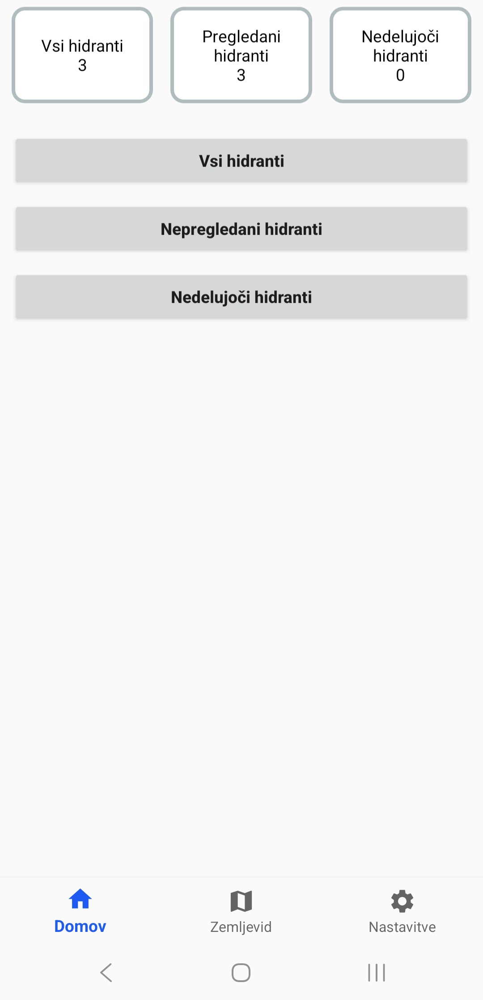
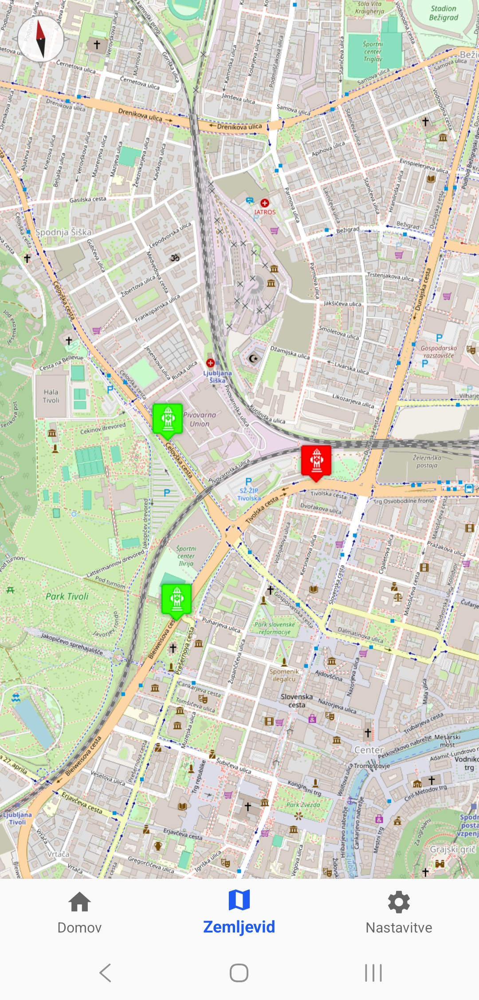
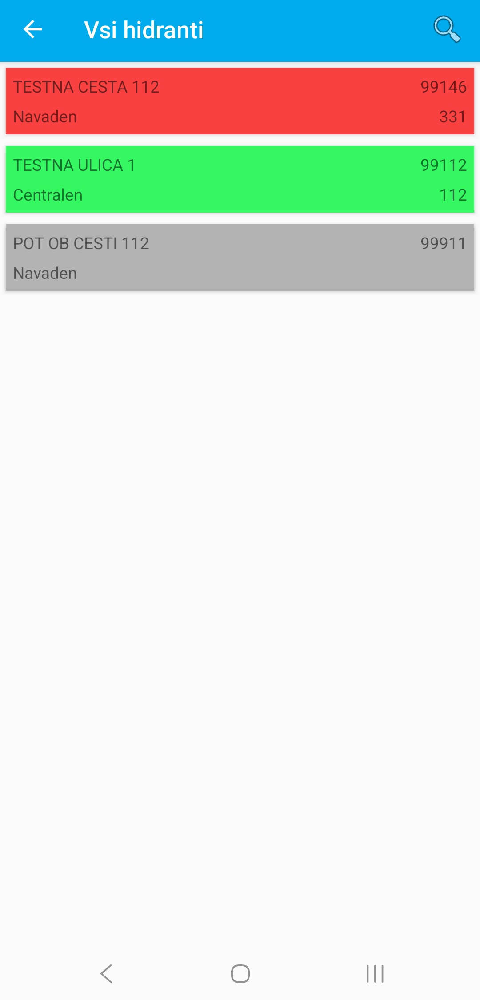
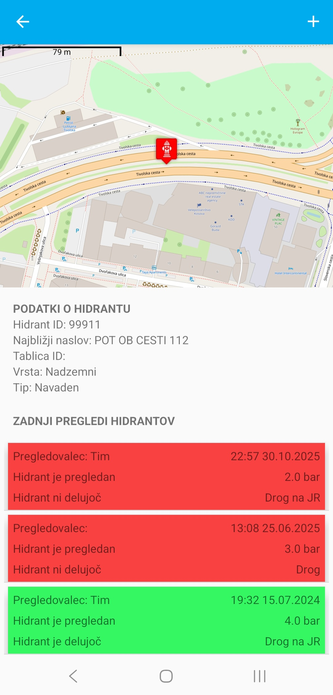
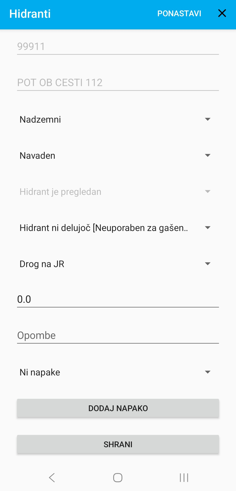

# HIDRANTI App

HIDRANTI is an Android application designed to make checking the condition of hydrants easier and more efficient. Users can view hydrants via a list or a map, inspect details, and synchronize hydrant information across multiple devices in real time. The app is secured with login, ensuring safe access to sensitive data.

## Features

- **Hydrant Overview:** Browse hydrants via interactive map or list view.  
- **Hydrant Inspection:** Click on a hydrant to view its data and last inspections.  
- **Real-Time Sync:** Hydrant data is updated across devices instantly.  
- **Map Editing:** Quickly edit hydrant details directly on the map.  
- **Visual Indicators:** Nearby hydrants are color-coded for easy identification.  
- **Hydrants Stats:** Main page displays key statistics at a glance.  
- **Proximity Access:** Users can view the closest 20 hydrants even if they are outside their district for emergency interventions.  
- **Secure Login:** Ensures only authorized users can access and modify hydrant data.  
- **Optimized Performance:** Fast loading and smooth user experience.

## Screenshots

| Main Page (Stats) | Hydrants Map | Hydrants List | Hydrant details | Hydrant Inspection Form |
|-----------------|-----------------|-----------------|-----------------|-----------------|
|  |  |  |  |  |

## Download

Get HIDRANTI on [Google Play](https://play.google.com/store/apps/details?id=com.hidranti.app).

## Support

- **Website:** [hidranti.si](https://hidranti.si)  
- **Email:** info@hidranti.si

